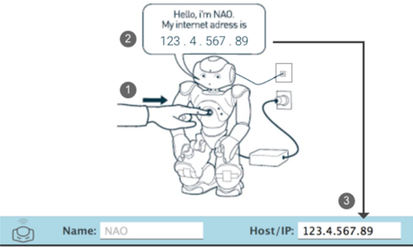

## 基本操作
### 设置你的机器人
#### 下载机器人配置软件

在您的电脑上，根据您的操作系统下载**Robot Settings安装程序**版本。

| 系统        | 版本                                    | 下载链接                                                     |
| :---------- | :-------------------------------------- | :----------------------------------------------------------- |
| **Linux**   | Ubuntu 16.04 Xenial Xerus - 64bits only | [Robot settings Linux 64 - Installer](https://community-static.aldebaran.com/resources/2.8.5/robot-settings-2.8.5.10-linux64-setup.run)[Robot settings Linux 64 - Tar](https://community-static.aldebaran.com/resources/2.8.5/robot-settings-2.8.5.10-linux64.tar.gz) |
| **Windows** | Microsoft Windows 10 - 64bits           | [Robot settings Win 64 - Installer](https://community-static.aldebaran.com/resources/2.8.5/robot-settings-2.8.5.10-win64-vs2015-setup.exe)[Robot settings Win 64 - Tar](https://community-static.aldebaran.com/resources/2.8.5/robot-settings-2.8.5.10-win64-vs2015.zip) |
| **Mac**     | Mac OS X 10.12 Sierra                   | [Robot settings Mac 64 - Installer](https://community-static.aldebaran.com/resources/2.8.5/robot-settings-2.8.5.10-mac64-setup.dmg)[Robot settings Mac 64 - Tar](https://community-static.aldebaran.com/resources/2.8.5/robot-settings-2.8.5.10-mac64.tar.gz) |

下载完成直接双击安装，完成后打开。

#### 获取机器人ip地址

1.使用网线进行连接后，从电脑端的app中设置机器人连接无线网



2.快速按下**NAO**的胸部按钮一次。NAO会复述他的IP地址的四个数字，用**点分隔**。

3.将IP地址填入ROBOT SETTING 界面，按ENTER键连接机器人NAO，并在用户界面中配置需要连接的WIFI，配置好即可拔掉网线，重新按压机器人胸部按钮，获得新的IP地址。


### 使用ALProxy代理连接

#### 下载安装Python SDK

**支持的操作系统**

| 系统        | 版本                                    |
| :---------- | :-------------------------------------- |
| **Linux**   | Ubuntu 16.04 Xenial Xerus - 64bits only |
| **Windows** | Microsoft Windows 10 **64bits**         |
| **Mac**     | Mac OS X 10.12 Sierra                   |

Mac10.12以上的版本也支持

#### Windows 

1.   下载安装Python **2.7**. [下载链接]( http://python.org/download/)
2. 下载*NAOqi for Python*: `pynaoqi-python2.7-2.8.6.23-win64-vs2015-20191127_152649.zip` [点击下载](https://community-static.aldebaran.com/resources/2.8.6/pynaoqi-python2.7-2.8.6.23-win64-vs2015-20191127_152649.zip).
3. 设置windows环境变量(网上可搜索添加教程)，添加一个用户变量
   - `variable`：PYTHONPATH       `value`:path\to\python-sdk\lib
4. 下载安装“Microsoft Visual C++ 2010 Redistributable Package (x86)

#### Mac

1. 确保 System Integrity Protection 被禁用。有关详细信息，请参考[[Apple\] Configuring System Integrity Protection ](https://developer.apple.com/library/content/documentation/Security/Conceptual/System_Integrity_Protection_Guide/ConfiguringSystemIntegrityProtection/ConfiguringSystemIntegrityProtection.html)
2. 安装python2.7[下载链接](http://python.org/download/): ，确保安装在`/usr/local/bin/python `, 而不是 `/usr/bin/python`
3. 下载NAOqi Mac版本`pynaoqi-python2.7-2.8.6.23-mac64-20191127_144231.tar.gz`。[点击下载](https://community-static.aldebaran.com/resources/2.8.6/pynaoqi-python2.7-2.8.6.23-mac64-20191127_144231.tar.gz).
4. 设置环境变量

```bash
$ export PYTHONPATH=${PYTHONPATH}:/path/to/python-sdk/lib/python2.7/site-packages
$ export DYLD_LIBRARY_PATH=${DYLD_LIBRARY_PATH}:/path/to/python-sdk/lib
$ export QI_SDK_PREFIX=/path/to/python-sdk
```


#### Linux

1. 确保Python版本为2.7
2. 下载安装NAOqi Linux版本，[点击下载](https://community-static.aldebaran.com/resources/2.8.6/pynaoqi-python2.7-2.8.6.23-linux64-20191127_152327.tar.gz).
3. 设置环境变量，也可更改bashrc文件。

```bash
$ export PYTHONPATH=${PYTHONPATH}:/path/to/python-sdk/lib/python2.7/site-packages
$ export QI_SDK_PREFIX=/path/to/python-sdk
```


#### 检查是否安装成功

在python2.7环境中使用

```python
import naoqi
```

#### ALProxy

`ALProxy `是一个代理对象，它允许用户通过机器人Nao在局域网内的IP地址和端口（port）访问连接到的所有方法或模块（如：`ALTextToSpeech`模块等等。

> class(module_name, ip_address, port)
>
> - module_name: 需要连接到的功能模块等
> - ip_address: 机器人nao的ip地址
> - port：Nao机器人侦听的端口（默认为9559）

模块的每个方法都可以通过对象直接访问，例如以下例程通过`ALTextToSpeech`的`say`方法实现远程控制Nao机器人说Hello World：

```PYTHON
from naoqi import ALProxy
tts = ALProxy("ALTextToSpeech", "<IP of your robot>", 9559)
tts.say("Hello, world!")
```

### 并行任务执行

用户初始化的每一个`ALProxy`对象都有一个名为`post`(代码中第五行)的属性，这能让每一个代理调用的方法同步=执行，而不需要按照正常python的执行顺序顺序执行，如以下实例实现了Nao机器人行走同时并说话：

```Python
from naoqi import ALProxy
motion = ALProxy("ALMotion", "<IP of your robot>", 9559)
tts    = ALProxy("ALTextToSpeech", "<IP of your robot>", 9559)
motion.setStiffnesses("Body", 1.0)
motion.moveInit()
motion.post.moveTo(0.5, 0, 0)
tts.say("I'm walking")
```

> 1. 除非您将关节的刚度设置为非0 的，否则机器人不会移动。为此，只需调用`ALMotion.setStiffnesses`方法， 如代码中第四行所示
> 2. `ALMotion.moveInit()` API 将机器人初始化在一个合适的位置（准备移动）
> 3. `ALMotion.moveTo() ` API 是机器人朝制定方向移动一段距离，单位（m) 
> 4. `ALMotion.post`使并行执行能

如果您需要等待直到给定任务完成，您可以使用ALProxy的wait方法，参数为post方法返回的任务id，示例如下：

```python
from naoqi import ALProxy
motion = ALProxy("ALMotion", "<IP of your robot>", 9559)
motion.moveInit()
id = motion.post.moveTo(0.5, 0, 0)
motion.wait(id, 0)
```

