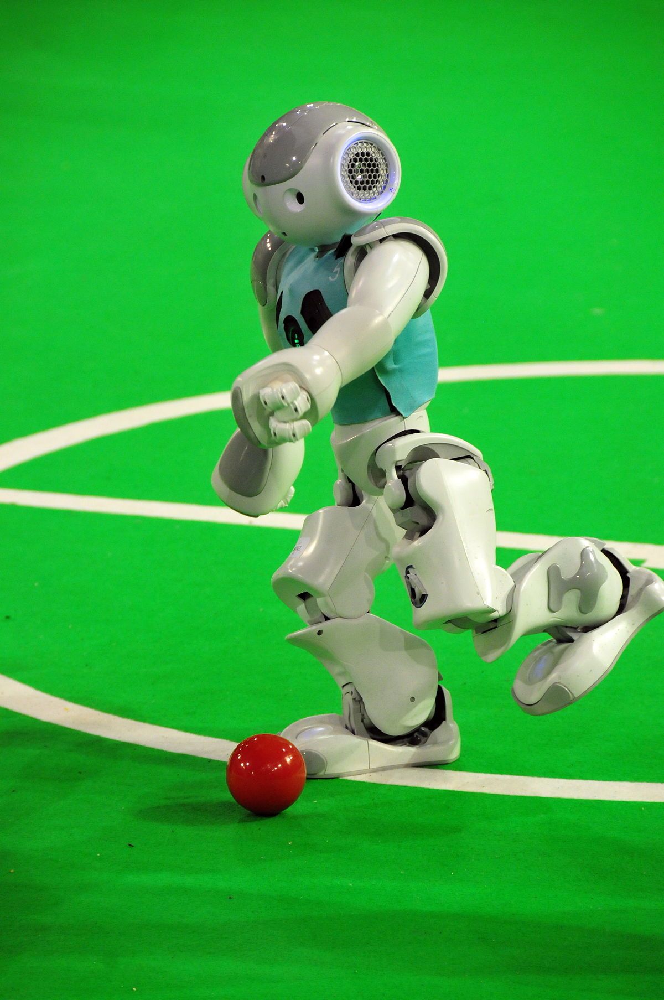

# NRA: a set of nao robot applications

[](https://github.com/TJ-Work/NRA/actions)
[](https://tj-work.github.io/NRA/)
[](https://github.com/TJ-Work/NRA/blob/main/LICENSE.txt)
[](https://github.com/TJ-Work/NRA/stargazers)

**[ 🏗 [Github Repo](https://github.com/TJ-Work/NRA) | 📜 [Documentation](https://tj-work.github.io/NRA/)_ ]**

Welcome to NRA! NRA is an set of NAO robot examples, including:

- 🎏 **kick ball**
- 📷 **dance**

## 🛠 Quick Start
0. Configure Environment
[Install the environment](https://tj-work.github.io/NRA/basic/)

1.Run the programm
```bash
cd Examples
python Nao_dance/Naodance.py
python Nao_kick_ball/kick_ball.py
```
## 🏫 Documentations

More information about NRA can be found in [NRA Documentation](https://tj-work.github.io/NRA/). 
Besides, the code can be found in [this repo](https://github.com/TJ-Work/NRA).


[](https://github.com/TJ-Work/NRA/graphs/contributors)
[](https://github.com/TJ-Work/NRA/network)
[](https://github.com/TJ-Work/NRA/issues)

